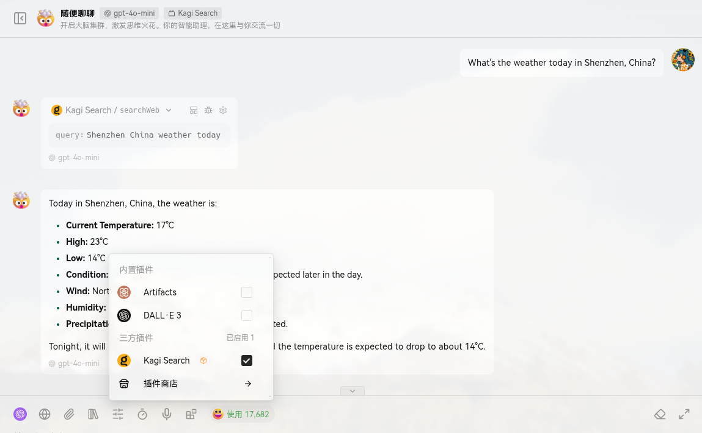

# 🔍 Lobechat-Plugin-Kagi

> 🤯 Supercharge your Lobechat with Kagi Search Engine, powered by Cloudflare Workers!

<details>
<summary>Click to view demo</summary>



</details>

## ⚙️ Development

We use [pnpm](https://pnpm.io/) as package manager. Follow these simple steps to get started:

```bash
# 📦 Install dependencies
pnpm install

# 🛠️ Start development server
pnpm dev
```

## 🌟 Deployment

This is a Cloudflare Worker project. Deploy it to Cloudflare Workers with just one command:

```bash
# 🚀 Build and deploy
pnpm run deploy
```

Once deployed, you can access your plugin manifest at:
`https://your-worker-name.your-account.workers.dev/manifest.json`

### ⚠️ Security Notice

> **Important**: For your security, please **DO NOT** use other people's deployments as they can potentially access your API_KEY and other sensitive information. Always deploy your own worker instance!
